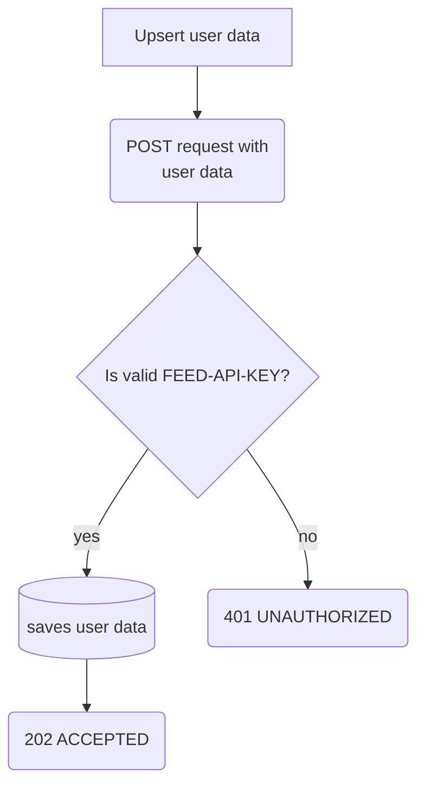
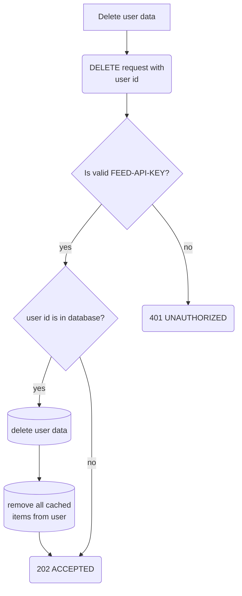
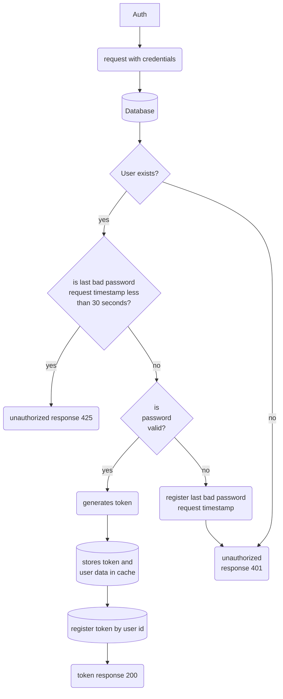
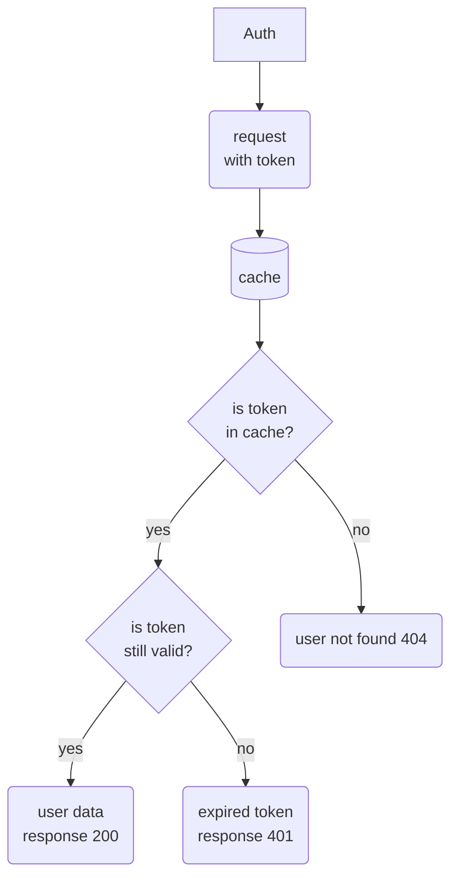
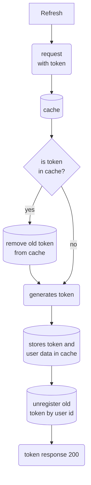

# auth-service
Auth and authorization generic microsservice

[](https://github.com/guionardo/auth-service/actions/workflows/codeql-analysis-golang.yml)
[](https://github.com/guionardo/auth-service/actions/workflows/codeql-analysis-python.yml)

## Features

* Authentication by credentials
* Authorization by JWT token

### User data feed upsert

```curl
curl -X POST {HOST}/user -d '{"userid":"","password_hash":"","payload":{}}' -H 'Content-Type: application/json' -H 'FEED-API-KEY: {feed API key}'

202 ACCEPTED
401 UNAUTHORIZED
```



### User data feed delete

```curl
curl -X DELETE {HOST}/user/{userid} -H 'FEED-API-KEY: {feed API key}'

202 ACCEPTED
401 UNAUTHORIZED
```



### Authentication by credentials

```curl
curl -X POST {HOST}/auth -d '{"username":"","password":""} -H 'Content-Type: application/json'

200 { "data":"token" }
401 { "data":"UNAUTHORIZED" }
425 { "data":"WAIT BEFORE NEW LOGIN ATTEMPT" }
```



### Authorization by token

```curl
curl {HOST}/auth -H "Accept: application/json" -H "Authorization: Bearer {token}"

200 { "data": { ... user data ...}}
401 { "data": "UNAUTHORIZED" }
404 { "data": "NOT FOUND" }
```



## Get refresh token

From a current valid token, get a special token, just used to refresh the current before it get expired.

```curl
curl {HOST}/refresh -H "Accept: application/json" -H "Authorization: Bearer {token}"

200 { "data": "new token" }
401 { "data": "UNAUTHORIZED" }
```


