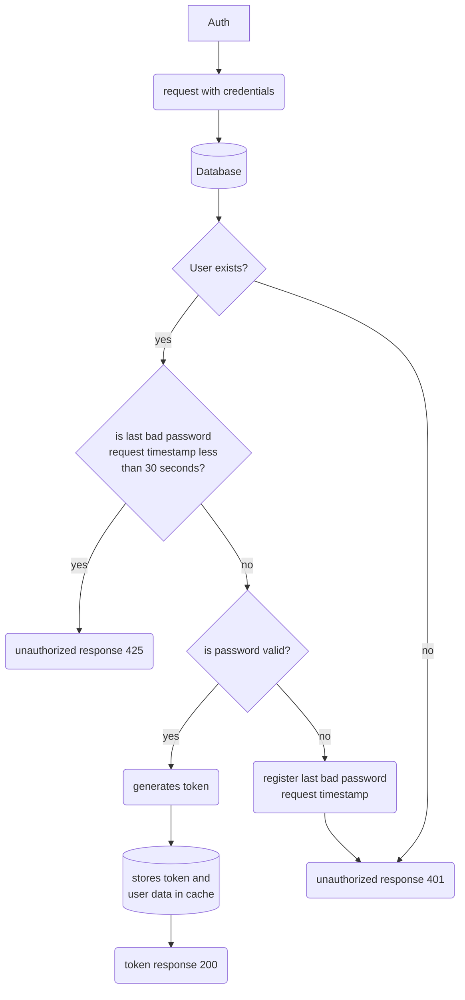
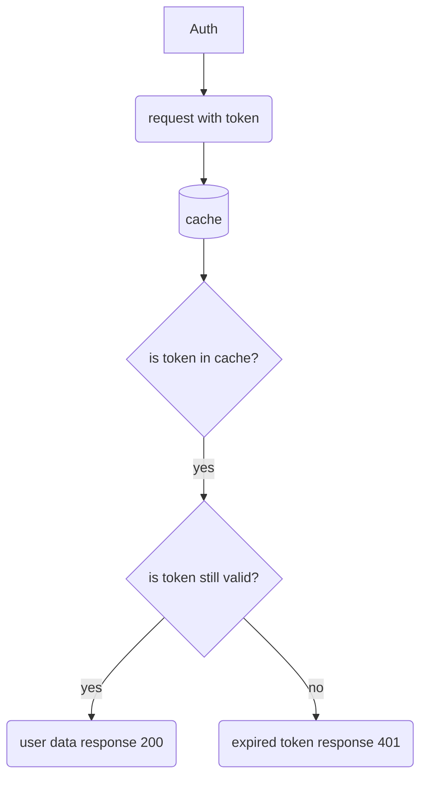

# auth-service
Auth and authorization generic microsservice

## Features

* Authentication by credentials
* Authorization by JWT token
  

### Authentication by credentials

```curl
curl -X POST {HOST}/auth -d '{"username":"","password":""} -H 'Content-Type: application/json'

200 { "data":"token" }
401 { "data":"UNAUTHORIZED" }
425 { "data":"WAIT BEFORE NEW LOGIN ATTEMPT" }
```



### Authorization by token

```curl
curl {HOST}/auth -H "Accept: application/json" -H "Authorization: Bearer {token}"
```

